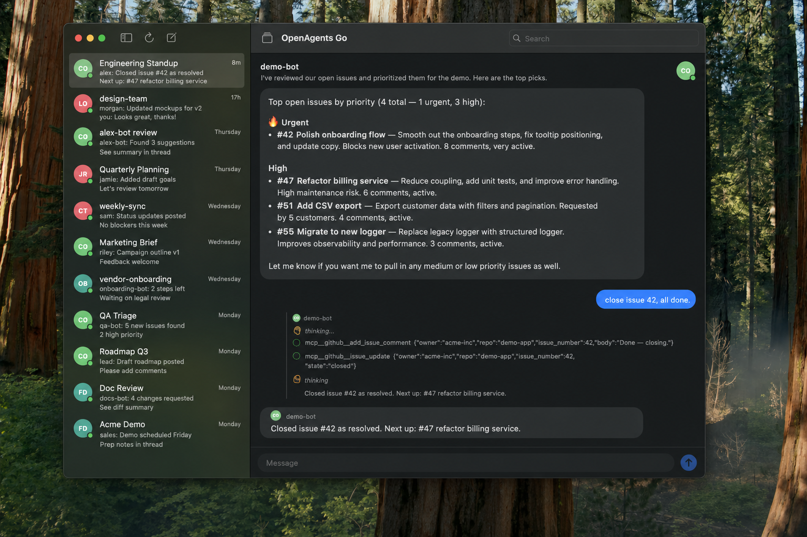

# Claude Code Agentrooms

Native macOS + iOS app for coordinating multiple Claude Code agents across local and remote machines. Route tasks with `@agent-name` mentions, orchestrate multi-agent workflows, see every agent's work in one threaded UI.



> **v1.0 is a full rewrite.** Earlier versions (Electron + Deno backend + React frontend) shipped through `v0.1.x`. The pre-v1 stack is preserved on the `pre-v1-archive` tag. v1.0+ is the [OpenAgents Go](https://github.com/openagentsorg/openagents) Swift universal app rebranded for the Claude Code use case — see [UPSTREAM.md](UPSTREAM.md).

## How it works

```
┌──────────────────────────┐         ┌────────────────────────────┐
│ Claude Code Agentrooms   │  HTTPS  │ OpenAgents workspace        │
│ (this app, macOS/iOS)    │ ──────▶ │ (workspace-endpoint.        │
│                          │         │  openagents.org or your own)│
└──────────────────────────┘         └────────────────────────────┘
                                                  │ /v1/discover
                                                  │ /v1/events
                                                  ▼
                            ┌─────────────────────────────────────┐
                            │ Remote machines running             │
                            │ @openagents-org/agent-connector     │
                            │ with `claude` runtime authorized    │
                            └─────────────────────────────────────┘
```

The app is the UI. The workspace endpoint is the backplane. Your Claude Code agents run wherever you install `agent-connector`.

## Setup

### 1. Install the app

Download the latest `.dmg` from [Releases](https://github.com/baryhuang/claude-code-by-agents/releases) (Apple Silicon).

iOS: TestFlight link coming with v1.1.

### 2. Set up a Claude Code agent on a remote machine

On any machine where you want a Claude Code agent to run (a Mac mini, a cloud instance, your laptop):

```sh
npm install -g @openagents-org/agent-connector

# Install the Claude runtime
agent-connector install claude

# Create an agent named e.g. "backend"
agent-connector create backend --type claude

# Authorize: agent-connector handles Claude OAuth for you on this machine
# Follow the prompts.

# Start the daemon
agent-connector up
```

### 3. Connect the agent to a workspace

You'll need a workspace URL with a token. Either:

- Use the public OpenAgents workspace at `https://workspace-endpoint.openagents.org` — sign in via the OpenAgents site to get a workspace + token, or
- Self-host the OpenAgents workspace backend (see [openagents/workspace](https://github.com/openagentsorg/openagents)).

```sh
agent-connector connect backend <workspace-token>
```

### 4. Open the app, paste the workspace URL

Launch Claude Code Agentrooms → paste your workspace URL (with `?token=`) into the selector → the app discovers your connected agents via `/v1/discover` and lists them.

## Usage

**One agent:** `@backend add a /healthz endpoint`

**Multiple agents:** `@frontend update the login page, then @backend wire up the new auth route` — the app routes each `@mention` to the right runtime.

## Build from source

Requires Xcode 16+ and [xcodegen](https://github.com/yonaskolb/XcodeGen).

```sh
brew install xcodegen
git clone https://github.com/baryhuang/claude-code-by-agents.git
cd claude-code-by-agents
xcodegen generate
open Agentrooms.xcodeproj
```

Build an ad-hoc signed DMG:

```sh
xcodebuild -project Agentrooms.xcodeproj -scheme Agentrooms \
  -configuration Release -derivedDataPath build/dd \
  CODE_SIGN_IDENTITY="-" CODE_SIGNING_REQUIRED=NO CODE_SIGNING_ALLOWED=NO build

STAGING=$(mktemp -d)
cp -R "build/dd/Build/Products/Release/Claude Code Agentrooms.app" "$STAGING/"
ln -s /Applications "$STAGING/Applications"
mkdir -p dist
hdiutil create -fs HFS+ -srcfolder "$STAGING" \
  -volname "Claude Code Agentrooms 1.0.0" \
  -format UDZO -ov "dist/Agentrooms-1.0.0-arm64.dmg"
```

## Architecture

See [UPSTREAM.md](UPSTREAM.md) for the source provenance and resync policy.

The app is ~1MB on disk. State lives in `WorkspaceStore` (one per connected workspace). All HTTP goes through `WorkspaceAPI` (an actor). No SSE/WebSocket — adaptive polling (1.5–3s for active threads, 5–15s for discovery). UI is SwiftUI with an iMessage-style 2-pane layout on macOS/iPad and push/pop navigation on iPhone.

## License

MIT
